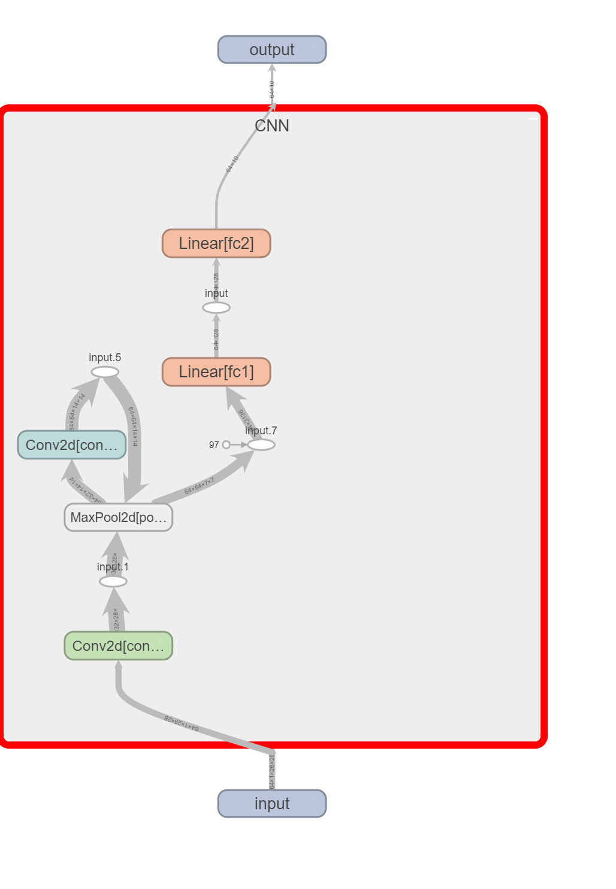
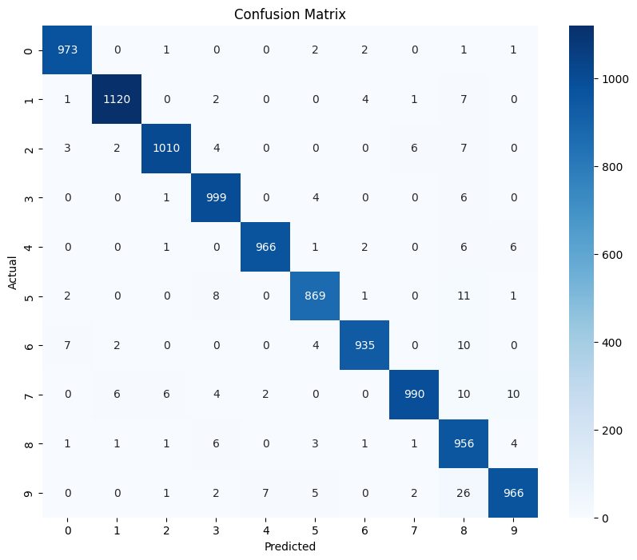

```python
import torch
import torch.nn as nn
import torch.optim as optim
import torchvision
import torchvision.transforms as transforms
from torch.utils.data import Dataset, DataLoader, TensorDataset

```


```python
import torchvision.datasets as datasets

# 列出torchvision.datasets模塊中的屬性
dataset_list = [attr for attr in dir(datasets) if not attr.startswith('__')]
print(dataset_list)

```

    ['CIFAR10', 'CIFAR100', 'Caltech101', 'Caltech256', 'CelebA', 'Cityscapes', 'CocoCaptions', 'CocoDetection', 'DatasetFolder', 'EMNIST', 'FakeData', 'FashionMNIST', 'Flickr30k', 'Flickr8k', 'HMDB51', 'INaturalist', 'ImageFolder', 'ImageNet', 'KMNIST', 'Kinetics', 'Kinetics400', 'Kitti', 'LFWPairs', 'LFWPeople', 'LSUN', 'LSUNClass', 'MNIST', 'Omniglot', 'PhotoTour', 'Places365', 'QMNIST', 'SBDataset', 'SBU', 'SEMEION', 'STL10', 'SVHN', 'UCF101', 'USPS', 'VOCDetection', 'VOCSegmentation', 'VisionDataset', 'WIDERFace', 'caltech', 'celeba', 'cifar', 'cityscapes', 'coco', 'fakedata', 'flickr', 'folder', 'hmdb51', 'imagenet', 'inaturalist', 'kinetics', 'kitti', 'lfw', 'lsun', 'mnist', 'omniglot', 'phototour', 'places365', 'sbd', 'sbu', 'semeion', 'stl10', 'svhn', 'ucf101', 'usps', 'utils', 'video_utils', 'vision', 'voc', 'widerface']
    

`torchvision.datasets` 提供了多種常用的圖像數據集。可以通過查閱官方文檔或直接在代碼中列出`torchvision.datasets`模塊中的屬性來查看支持的數據集列表。以下是兩種方法：


可以訪問 [torchvision.datasets](https://pytorch.org/vision/stable/datasets.html) 的官方文檔，這裡詳細列出了所有支持的數據集。

不同的數據集類別。例如：

- `MNIST`: 手寫數字數據集
- `CIFAR10`: 10類彩色圖像數據集
- `ImageNet`: 大規模圖像數據集
- `FashionMNIST`: 時尚物品手寫數字數據集


```python
device = torch.device("cuda" if torch.cuda.is_available() else "cpu")


# 定義數據轉換
transform = transforms.Compose([
    transforms.ToTensor(),  # 將圖片轉換為張量
    transforms.Normalize((0.5,), (0.5,))  # 標準化圖片
])

# 加載訓練數據集
trainset = torchvision.datasets.MNIST(
    root='./data',  # 數據存放路徑
    train=True,  # 是否為訓練集
    download=True,  # 如果數據集不存在，則下載
    transform=transform  # 應用數據轉換
)

train_loader = DataLoader(
    trainset, 
    batch_size=64,  # 每個批次的大小
    shuffle=True  # 是否打亂數據
)

# 加載測試數據集
testset = torchvision.datasets.MNIST(
    root='./data', 
    train=False, 
    download=True, 
    transform=transform
)

test_loader = DataLoader(
    testset, 
    batch_size=64, 
    shuffle=False
)

# 檢查數據加載器
for images, labels in train_loader:
    print(f'Batch size: {images.size()}')  # 打印每個批次的大小
    break  # 只打印第一個批次
```

    Batch size: torch.Size([64, 1, 28, 28])
    


```python
# 定義CNN模型
class CNN(nn.Module):
    def __init__(self):
        super(CNN, self).__init__()
        self.conv1 = nn.Conv2d(1, 32, kernel_size=3, stride=1, padding=1)
        self.conv2 = nn.Conv2d(32, 64, kernel_size=3, stride=1, padding=1)
        self.pool = nn.MaxPool2d(kernel_size=2, stride=2, padding=0)
        self.fc1 = nn.Linear(64 * 7 * 7, 128)
        self.fc2 = nn.Linear(128, 10)
    
    def forward(self, x):
        x = self.pool(torch.relu(self.conv1(x)))
        x = self.pool(torch.relu(self.conv2(x)))
        x = x.view(-1, 64 * 7 * 7)
        x = torch.relu(self.fc1(x))
        x = self.fc2(x)
        return x
```

## CNN模型的定義與解釋

在深度學習中，卷積神經網絡（Convolutional Neural Networks, CNNs）廣泛應用於圖像和視頻處理任務。以下是一個簡單的CNN模型的定義及其詳細解釋。

### 模型結構解釋

1. **卷積層1（conv1）**
   - `nn.Conv2d(1, 32, kernel_size=3, stride=1, padding=1)`
   - 輸入通道數為1（灰度圖像），輸出通道數為32，卷積核大小為3x3，步幅為1，填充為1。
   - 這一層的作用是提取圖像的局部特征。

2. **卷積層2（conv2）**
   - `nn.Conv2d(32, 64, kernel_size=3, stride=1, padding=1)`
   - 輸入通道數為32，輸出通道數為64，卷積核大小為3x3，步幅為1，填充為1。
   - 這一層進一步提取圖像的高級特征。

3. **池化層（pool）**
   - `nn.MaxPool2d(kernel_size=2, stride=2, padding=0)`
   - 最大池化操作，池化窗口大小為2x2，步幅為2。
   - 這一層的作用是減小特征圖的尺寸，從而減少參數量和計算量，同時保留最重要的特征。

4. **全連接層1（fc1）**
   - `nn.Linear(64 * 7 * 7, 128)`
   - 將卷積層輸出的64個7x7特征圖展平成一維向量，並連接到一個128維的向量。
   - 這一層的作用是對提取的特征進行非線性組合，以便進行分類。

5. **全連接層2（fc2）**
   - `nn.Linear(128, 10)`
   - 將128維向量連接到一個10維向量（假設有10個分類）。
   - 這一層的輸出是未經過激活函數的分類得分。

### 前向傳播過程解釋

1. **輸入層**
   - 輸入的圖像數據通過`conv1`進行第一次卷積操作，得到32個特征圖。
   - 通過ReLU激活函數後，再通過池化層`pool`進行下采樣。

2. **中間層**
   - 下采樣後的特征圖通過`conv2`進行第二次卷積操作，得到64個特征圖。
   - 通過ReLU激活函數後，再通過池化層`pool`進行下采樣。

3. **展平層**
   - 將第二次池化後的特征圖展平成一維向量，以便輸入全連接層。
   - 展平操作通過`x.view(-1, 64 * 7 * 7)`實現。

4. **全連接層**
   - 展平後的一維向量通過`fc1`全連接層，得到128維的向量。
   - 通過ReLU激活函數後，通過`fc2`全連接層，得到10維的分類得分。

### 關於輸出層與損失函數

在上述模型中，最後一層的輸出是一個線性層，即`nn.Linear(128, 10)`。這個輸出不是經過Softmax激活函數的概率分布，而是未激活的分類得分。

這是因為我們在訓練模型時使用的損失函數是`nn.CrossEntropyLoss()`。`nn.CrossEntropyLoss()`函數在內部會對輸入進行Softmax操作，然後計算交叉熵損失。因此，在定義模型時，不需要在最後一層添加Softmax激活函數，直接輸出線性層的結果即可。這樣可以提高數值穩定性，並簡化代碼。


在 Jupyter Notebook 或 IPython 中，你可以使用 help 函數來查閱各種模塊和函數的詳細說明。或是問號家在後面。(個人推薦問號)

help(nn.MaxPool2d)

nn.MaxPool2d?  


```python
from torchinfo import summary
model = CNN().to(device)
summary(model, input_size=(64, 1, 28, 28))
```


    ==========================================================================================
    Layer (type:depth-idx)                   Output Shape              Param #
    ==========================================================================================
    CNN                                      [64, 10]                  --
    ├─Conv2d: 1-1                            [64, 32, 28, 28]          320
    ├─MaxPool2d: 1-2                         [64, 32, 14, 14]          --
    ├─Conv2d: 1-3                            [64, 64, 14, 14]          18,496
    ├─MaxPool2d: 1-4                         [64, 64, 7, 7]            --
    ├─Linear: 1-5                            [64, 128]                 401,536
    ├─Linear: 1-6                            [64, 10]                  1,290
    ==========================================================================================
    Total params: 421,642
    Trainable params: 421,642
    Non-trainable params: 0
    Total mult-adds (M): 273.85
    ==========================================================================================
    Input size (MB): 0.20
    Forward/backward pass size (MB): 19.34
    Params size (MB): 1.69
    Estimated Total Size (MB): 21.23
    ==========================================================================================


```python
from torch.utils.tensorboard import SummaryWriter
writer = SummaryWriter()

t_input = torch.randn(64, 1, 28, 28).to(device) 

writer.add_graph(model, t_input)
writer.close()
```




```python
# 定義損失函數和優化器
criterion = nn.CrossEntropyLoss()
optimizer = optim.Adam(model.parameters(), lr=0.01)

# 基本訓練結構

# 訓練模型
epochs = 100
for epoch in range(epochs):
    model.train()
    for xb, yb in train_loader:
        xb, yb = xb.to(device), yb.to(device)  # 確保數據在正確的設備上
        optimizer.zero_grad()
        y_pred = model(xb)
        loss = criterion(y_pred, yb)
        loss.backward()
        optimizer.step()
    if (epoch + 1) % 10 == 0:
        print(f'Epoch {epoch + 1}/{epochs}, Loss: {loss.item()}')
```

    Epoch 10/100, Loss: 0.14309175312519073
    Epoch 20/100, Loss: 0.006036754231899977
    Epoch 30/100, Loss: 0.23389318585395813
    Epoch 40/100, Loss: 0.12435180693864822
    Epoch 50/100, Loss: 0.054645176976919174
    Epoch 60/100, Loss: 0.16405026614665985
    Epoch 70/100, Loss: 8.377063932130113e-05
    Epoch 80/100, Loss: 0.0001794969866750762
    Epoch 90/100, Loss: 0.037339773029088974
    Epoch 100/100, Loss: 0.0
    

在 Python 中，f 字符串（也稱為 f-string 或格式化字符串）是一種簡潔且直觀的字符串格式化方法。它是從 Python 3.6 開始引入的。通過在字符串前添加 f 或 F，可以在字符串中直接嵌入表達式並求其值。


```python
from sklearn.metrics import confusion_matrix, accuracy_score
import matplotlib.pyplot as plt
import seaborn as sns


model.eval()
test_predictions = []
test_actuals = []
with torch.no_grad():
    for xb, yb in test_loader:
        xb, yb = xb.to(device), yb.to(device)  # 確保數據在正確的設備上
        y_pred = model(xb)
        _, predicted  = torch.max(y_pred,1)
        test_predictions.append(predicted.cpu())  # 將預測值移回 CPU
        test_actuals.append(yb.cpu())  # 將實際值移回 CPU

# 將列表中的張量拼接成一個張量
test_predictions = torch.cat(test_predictions)
test_actuals = torch.cat(test_actuals)

# 計算混淆矩陣
conf_matrix = confusion_matrix(test_actuals, test_predictions)
accuracy = accuracy_score(test_actuals, test_predictions)

# 打印混淆矩陣
print(f'Accuracy: {accuracy*100:.2f}%')

# 可視化混淆矩陣
plt.figure(figsize=(10, 8))
sns.heatmap(conf_matrix, annot=True, fmt='d', cmap='Blues')
plt.xlabel('Predicted')
plt.ylabel('Actual')
plt.title('Confusion Matrix')
plt.show()
```

    Accuracy: 97.84%
    


    

    


```python
# # 如果要取得機率分布，最後輸出要經過一層Softmax計算概率分布
# import torch.nn.functional as F
# # 假設輸入是xb
# xb = torch.randn(1, 1, 28, 28)  # 1張 1通道 28x28 的圖像

# # 獲取模型的原始輸出
# logits = model(xb)

# # 使用Softmax計算概率分布
# probabilities = F.softmax(logits, dim=1)
```


```python

```
